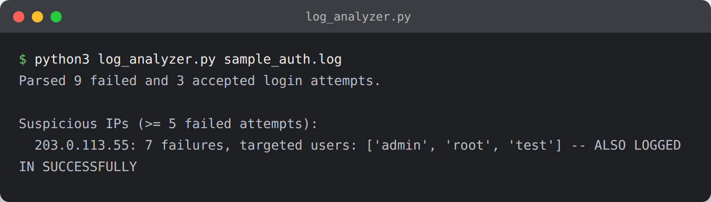
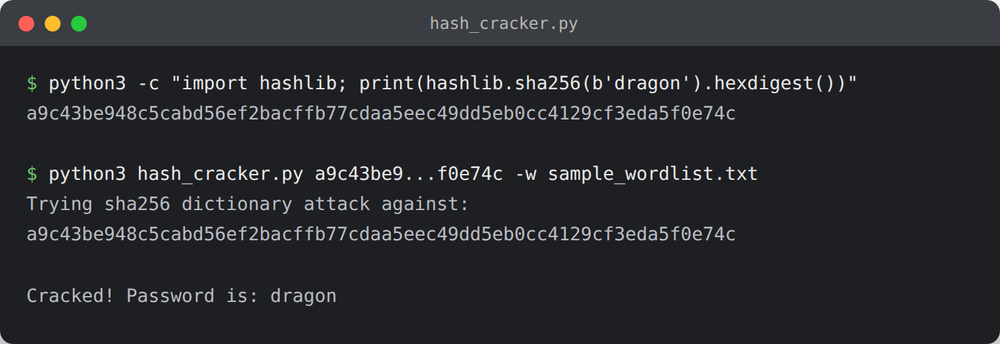

<div align="center">

# Beginner Cybersecurity Projects


A collection of small, self-contained security projects for building practical skills and a portfolio for entry-level security roles (SOC analyst, security engineer, junior pentester, IT security). Each project is a standalone Python script with its own README covering usage and the concepts it demonstrates.

</div>

## Quick navigation

- [Projects](#projects) — hands-on tools with full source code
- [Screenshots](#screenshots) — see a few of them running
- [Getting started](#getting-started) — clone and run locally
- [Legal/ethical note](#legalethical-note) — read before running the network/hash tools
- [Using this for job applications](#using-this-for-job-applications)

## Projects

| Project | Level | Time | Skills demonstrated |
|---|---|---|---|
| [password-strength-checker](password-strength-checker/) | Beginner | 1-2h | Input validation, entropy/scoring logic |
| [caesar-cipher-tool](caesar-cipher-tool/) | Beginner | 1h | Classical cryptography, brute forcing |
| [hash-cracker](hash-cracker/) | Beginner | 1-2h | Password hashing, dictionary attacks |
| [port-scanner](port-scanner/) | Beginner | 2-3h | Sockets, TCP/IP, concurrency |
| [file-integrity-monitor](file-integrity-monitor/) | Beginner | 2-3h | Hashing, filesystem monitoring (FIM) |
| [phishing-url-detector](phishing-url-detector/) | Beginner | 2-3h | Heuristics, social-engineering awareness |
| [log-analyzer](log-analyzer/) | Beginner | 2-4h | Log parsing, brute-force/intrusion detection |
| [packet-sniffer](packet-sniffer/) | Beginner | 2-4h | Packet capture/analysis with Scapy |

Time estimates are rough, assuming you read the code and try the usage examples rather than just running it once.

## Screenshots

**[log-analyzer](log-analyzer/)** catching a brute-force IP in a sample auth log:



**[phishing-url-detector](phishing-url-detector/)** scoring a suspicious URL:


**[hash-cracker](hash-cracker/)** recovering a password from its hash via dictionary attack:



Every project folder has its own README with a screenshot and usage examples.

## Getting started

```bash
git clone https://github.com/studywithval/beginner-cybersecurity-projects.git
cd beginner-cybersecurity-projects
python3 -m venv .venv && source .venv/bin/activate
pip install -r requirements.txt
```

Each project folder has its own README with usage examples and sample data where relevant.

## Legal/ethical note

Only scan, sniff, or test systems and networks you own or have explicit written authorization to test. Several of these tools (port-scanner, packet-sniffer, hash-cracker) are dual-use; running them against systems you don't control may violate laws such as the U.S. Computer Fraud and Abuse Act or equivalent legislation elsewhere.

## Using this for job applications

- Link this repo directly on your resume/LinkedIn as a portfolio project.
- In interviews or cover letters, describe each tool in terms of the problem it solves, e.g. "Built a log analyzer that flags brute-force SSH attempts from auth logs by correlating failed logins per source IP."
- Stand out further by extending a project: add unit tests, a `--json` output mode, or a small web dashboard on top of one of these scripts.
