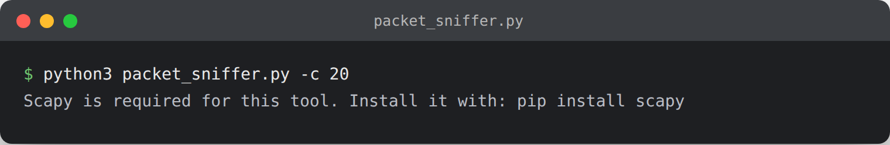

# Packet Sniffer

Captures live network packets with Scapy and prints a one-line summary per packet (protocol, source/destination IP, ports).



## Usage

```bash
pip install scapy
sudo python3 packet_sniffer.py -c 20

# Only capture HTTPS traffic
sudo python3 packet_sniffer.py -f "tcp port 443"
```

Requires root/admin privileges (raw socket access) and must only be run on a network you own or are authorized to monitor - e.g. your own home network or a lab VM, not shared/corporate networks without permission.

## What it demonstrates

- Reading raw packets off the wire and parsing protocol layers (IP/TCP/UDP)
- BPF filter syntax, used across tcpdump, Wireshark, and Scapy
- The foundation for building custom IDS/traffic-analysis tooling
