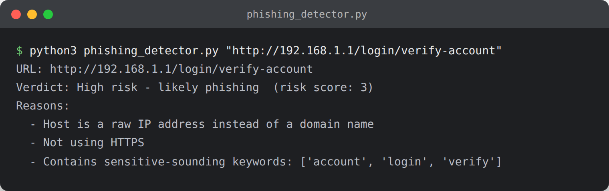

# Phishing URL Detector

Scores a URL against common phishing red flags: IP-address hosts, URL shorteners, excessive length, `@` tricks, deep subdomains, missing HTTPS, sensitive keywords, and hyphenated lookalike domains.



## Usage

```bash
python3 phishing_detector.py "http://192.168.1.1/login/verify-account"
python3 phishing_detector.py "https://www.paypal.com/signin"
```

This tool never makes a network request - it only analyzes the URL string itself, so it's safe to run against any URL, including ones you're not sure about.

## What it demonstrates

- The heuristics real email/browser phishing filters check first, before threat-intel lookups
- Social engineering awareness relevant to SOC analyst and security awareness roles
- Rule-based scoring as a lightweight alternative to ML classifiers
