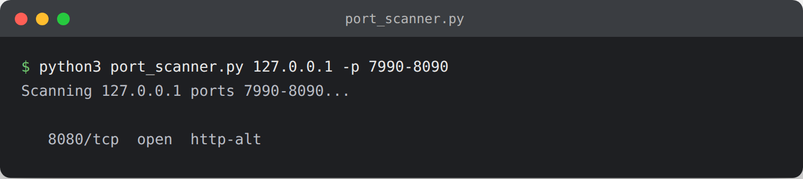

# TCP Port Scanner

A multithreaded TCP connect scanner, the same technique underlying tools like Nmap's `-sT` scan.



## Usage

```bash
# Scan localhost, ports 1-1024 (default)
python3 port_scanner.py

# Scan a specific host/range you're authorized to test
python3 port_scanner.py 192.168.1.10 -p 1-65535
```

## Only scan systems you own or are authorized to test

Port scanning third-party systems without permission is illegal in most jurisdictions. Use this against `127.0.0.1`, a VM you control, or a host in a lab environment (e.g. TryHackMe, HackTheBox, a home lab).

## What it demonstrates

- TCP three-way handshake basics (`connect()` succeeding means the port is open)
- Concurrency with `ThreadPoolExecutor` for speed
- Mapping ports to well-known services
